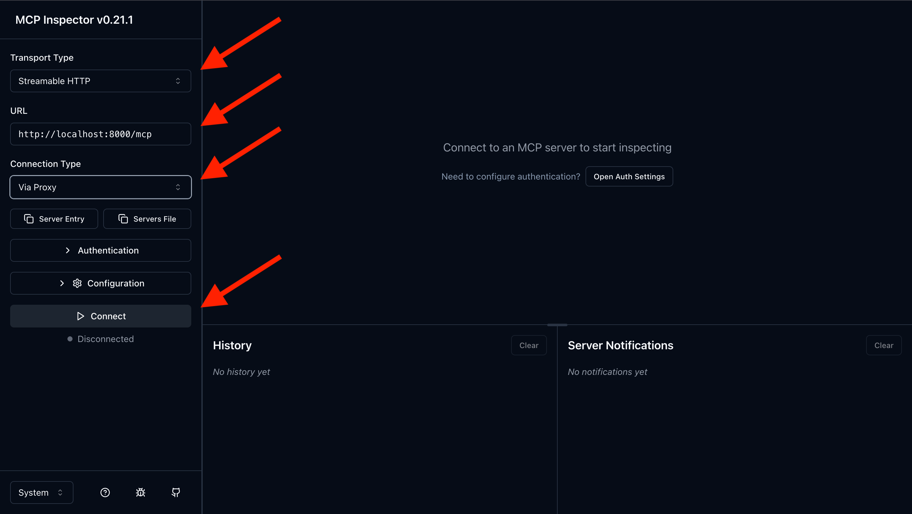

# Git Changelog MCP Server 🚀

**MCP-сервер для генерации changelog и release notes на основе git-истории**

Анализирует коммиты (поддерживает Conventional Commits и неформальные сообщения), генерирует структурированный CHANGELOG и красивые release notes. Работает локально через Docker, поддерживает внешнюю AI-интеграцию (в MVP реализовано через GitHub Models).

---

## 🎯 Что решает

### Проблема
- Вручную писать changelog для каждого релиза — долго и скучно
- Забывают упомянуть важные изменения и breaking changes
- AI-агентам нужен структурированный доступ к git-истории
- Сложно восстановить контекст после перерыва в проекте

### Решение
**git-changelog-mcp** — MCP-сервер, который:
- 📊 Автоматически анализирует git-историю автоматически
- 📝 Генерирует CHANGELOG по шаблонам (markdown/json/keepachangelog)
- ✨ Создаёт release notes с AI-улучшением через внешнюю интеграцию (опционально)
- 🎯 Поддерживает Conventional Commits и неформальные сообщения (особенно в release notes с AI)
- 🔍 Помогает быстро восстановить контекст проекта после перерыва

### Для кого
| Аудитория | Выгода |
|-----------|--------|
| **Разработчики** | Автоматический changelog без ручной работы |
| **Менеджеры** | Понятные release notes для стейкхолдеров и публикаций в соцсетях |
| **AI-агенты** | Структурированный доступ к git-истории через MCP |
| **DevOps** | Docker-образ ≤500 МБ, готов к CI/CD |

---

## 🚀 Быстрый старт

### Требования
- Docker 20.10+

### Установка и запуск

#### 1. Сборка Docker-образа
```bash
docker build -t git-changelog-mcp .
```

#### 2. Запуск сервера
```bash
docker run -p 8000:8000 -v $(pwd)/demo_project:/app/projects git-changelog-mcp serve
```

> **Важно:** Для работы сервера нужно предоставить контейнеру доступ к вашему репозиторию через volume mount (-v):
> ```bash
> # Маунт текущего проекта (вашу папку со всем содержимым контейнер увидит как /app/projects)
> docker run -p 8000:8000 \
>   -v /path/to/your/repo:/app/projects \
>   git-changelog-mcp serve
> ```
> **Без mount** контейнер не будет иметь доступа к внешним репозиториям для анализа.

> **Примечание:** Переменные окружения не требуются для базового режима.  
> Для расширенного режима с AI создайте файл `.env` (см. [Расширенный режим](#-расширенный-режим)).

#### 3. Проверка работоспособности
```bash
curl http://localhost:8000/health
```

**Ожидаемый ответ:**
```json
{"status": "healthy", "service": "git-changelog-mcp"}
```

#### 4. Подключение через MCP Inspector
```bash
# Установите MCP Inspector (если не установлен)
npm install -g @modelcontextprotocol/inspector

# Запуск Inspector
npx @modelcontextprotocol/inspector@latest
```

В Inspector укажите:
- **Transport:** Streamable HTTP
- **URL:** `http://localhost:8000/mcp`

---

## 🛠️ Инструменты

Сервер реализует **2 основных инструмента**:

### `generate_changelog`

Генерирует CHANGELOG из git-истории репозитория.

| Параметр | Тип | По умолчанию | Описание |
|----------|-----|--------------|----------|
| `repo_path` | string | **required** | Путь к git-репозиторию |
| `output_format` | string | `"markdown"` | Формат: `markdown`, `json`, `keepachangelog` |
| `from_version` | string | `null` | Начать с конкретной версии (например, `v1.0.0`) |
| `include_unreleased` | boolean | `true` | Включать незавершённые изменения |

**Пример вызова:**
```json
{
  "tool": "generate_changelog",
  "arguments": {
    "repo_path": "/path/to/repo",
    "output_format": "markdown",
    "from_version": "v1.0.0",
    "include_unreleased": true
  }
}
```

**Пример вывода:**
```markdown
# Changelog

## Unreleased

### Features
- Add user authentication (#42) @john-doe

### Bug Fixes
- Fix login redirect issue (#45) @jane-smith

## v1.2.0 (2026-02-28)

### Features
- Implement dark mode (#38) @alex-dev

### Breaking Changes
- API endpoint `/users` changed to `/api/v2/users`
```

---

### `generate_release_notes`

Создаёт подробные release notes для конкретной версии с поддержкой AI.

| Параметр | Тип | По умолчанию | Описание |
|----------|-----|--------------|----------|
| `repo_path` | string | **required** | Путь к git-репозиторию |
| `version` | string | **required** | Версия (например, `v1.2.0`) |
| `style` | string | `"markdown"` | Стиль: `markdown`, `brief`, `detailed` |
| `use_ai` | boolean | `true` | Использовать AI для улучшения |
| `include_breaking_changes` | boolean | `true` | Включать секцию breaking changes |

**Пример вызова:**
```json
{
  "tool": "generate_release_notes",
  "arguments": {
    "repo_path": "/path/to/repo",
    "version": "v1.2.0",
    "style": "detailed",
    "use_ai": true,
    "include_breaking_changes": true
  }
}
```

**Пример вывода:**
```markdown
# Release Notes v1.2.0

📅 **Дата:** 28 февраля 2026

## ✨ Новые возможности

- **Тёмная тема** — добавлена поддержка тёмного режима интерфейса
- **Уведомления** — реализована система push-уведомлений

## ⚠️ Breaking Changes

> **Внимание:** Требуется миграция API

- Эндпоинт `/users` перемещён на `/api/v2/users`
- Формат ответа изменился: поле `user_id` → `id`

### Руководство по миграции

```bash
# Старый запрос
curl /users/123

# Новый запрос
curl /api/v2/users/123
```

## 🐛 Исправления

- Исправлен редирект после логина (#45)
- Утечка памяти в фоновых задачах (#41)

---
**Всего изменений:** 15 коммитов от 5 авторов
```

---

## 📖 Использование

### Docker

#### Анализ репозитория (с volume mount)
```bash
# Маунт репозитория в контейнер
docker run -p 8000:8000 \
  -v /path/to/repo:/app/projects/my-repo \
  git-changelog-mcp serve

# Пример с demo_project
docker run -p 8000:8000 \
  -v $(pwd)/demo_project:/app/projects/demo_project \
  git-changelog-mcp serve
```

Теперь в MCP Inspector используйте путь `/app/projects/demo_project`.

#### Запуск с AI-поддержкой
```bash
# С GitHub Models
docker run -p 8000:8000 \
  --env-file .env \
  -v $(pwd)/demo_project:/app/projects/demo_project \
  git-changelog-mcp serve
```

#### Smoke test
```bash
docker run --rm git-changelog-mcp smoke
```

**Ожидаемый вывод:**
```
🏥 Running smoke test...

⏳ Waiting for server to start (max 30s)...
✅ Server started after 2s

🔍 Checking health endpoint...
   HTTP Status: 200
   Response: {"status": "healthy", "service": "git-changelog-mcp"}

✅ Smoke test PASSED (HTTP 200)
```

### MCP Inspector

1. Откройте MCP Inspector в браузере
2. Подключитесь к `http://localhost:8000/mcp`
3. Выберите инструмент из списка
4. Заполните параметры и выполните

### Примеры использования

#### Генерация CHANGELOG для всего репозитория
```bash
curl -X POST http://localhost:8000/mcp \
  -H "Content-Type: application/json" \
  -d '{
    "tool": "generate_changelog",
    "arguments": {
      "repo_path": "/app/demo_project",
      "output_format": "keepachangelog"
    }
  }'
```

#### Release notes с AI для версии v1.2.0
```bash
curl -X POST http://localhost:8000/mcp \
  -H "Content-Type: application/json" \
  -d '{
    "tool": "generate_release_notes",
    "arguments": {
      "repo_path": "/app/projects/demo_project",
      "version": "v1.2.0",
      "style": "detailed",
      "use_ai": true
    }
  }'
```

---

## 🔧 Расширенный режим

### AI-интеграция

Для включения AI-генерации release notes создайте файл `.env` в корне проекта:

```bash
# .env
GITHUB_TOKEN=ghp_your_token_here
AI_PROVIDER=github
AI_MODEL=gpt-4.1-mini
```

Или передайте переменные при запуске Docker:

```bash
docker run -p 8000:8000 \
  --env-file .env \
  -v $(pwd)/demo_project:/app/projects/demo_project \
  git-changelog-mcp serve
```

**Базовая работа не требует переменных!** Сервер работает сразу после установки.

#### Провайдеры AI

**GitHub Models (рекомендуется для хакатона):**
```bash
GITHUB_TOKEN=ghp_your_token
AI_PROVIDER=github
AI_MODEL=gpt-4.1-mini
```
✅ Бесплатно во время хакатона | Без кредитной карты

**OpenAI:**
```bash
OPENAI_API_KEY=sk-...
AI_PROVIDER=openai
AI_MODEL=gpt-3.5-turbo
```
💰 ~$0.01 за release notes

**Ollama (локально):**
```bash
AI_PROVIDER=ollama
AI_MODEL=llama3.1
```
✅ Полностью бесплатно, работает офлайн

---

## 📋 Ограничения

### Поддерживается
- ✅ Conventional Commits (`feat:`, `fix:`, `docs:`, `refactor:`, `test:`, `chore:`, `ci:`)
- ✅ Семантическое версионирование (теги `v1.0.0`, `1.0.0`)
- ✅ Breaking changes через `!` или `BREAKING CHANGE:` в коммите
- ✅ Группировка по версиям и типам изменений
- ✅ Несколько форматов вывода (markdown, json, keepachangelog)

### Не поддерживается
- ❌ Моно-репозитории с несколькими пакетами
- ❌ Кастомные форматы коммитов (только Conventional Commits)
- ❌ Инкрементальная генерация (всегда полная пересборка)

### Тестовый проект
Проверено на **demo_project**:
- 17 коммитов с различными типами
- 3 тега (`v1.0.0`, `v1.1.0`, `v1.2.0`)
- 1 breaking change
- 2 non-conventional коммита (корректно игнорируются)

Создание тестового проекта:
```bash
bash scripts/create_demo_project.sh
```

---

**Сделано с ❤️ для хакатона**
